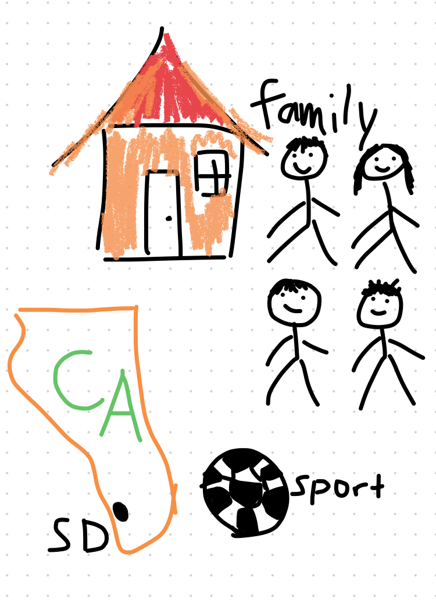

## About ME
 - Freeform Image About Me:
 

 - Some of my freinds and teachers know that I moved here from another country to US in the summer of 2019 and started school 6th in Oak Valley. So this is my 4th year after moving from my country.

> ## Schedule
>> Period 1: Integrated Math 3b

>> Period 2: Pre-Calculus 1

>> Period 3: Data Structure 1

>> Period 4: AP Chinese Seminar

>> Period 5: World Geography and Cultures

## Overview of Hacks, Study and Tangibles

Blogging in GitHub pages is a way to learn and code at the same time. 

- Plans, Lists, [Scrum Boards](https://clickup.com/blog/scrum-board/) help you to track key events, show progress and record time.  Effort is a big part of your class grade.  Show plans and time spent!
- [Hacks(Todo)](https://levelup.gitconnected.com/six-ultimate-daily-hacks-for-every-programmer-60f5f10feae) enable you to stay in focus with key requirements of the class.  Each Hack will produce Tangibles.
- Tangibles or [Tangible Artifacts](https://en.wikipedia.org/wiki/Artifact_(software_development)) are things you accumulate as a learner and coder. 
